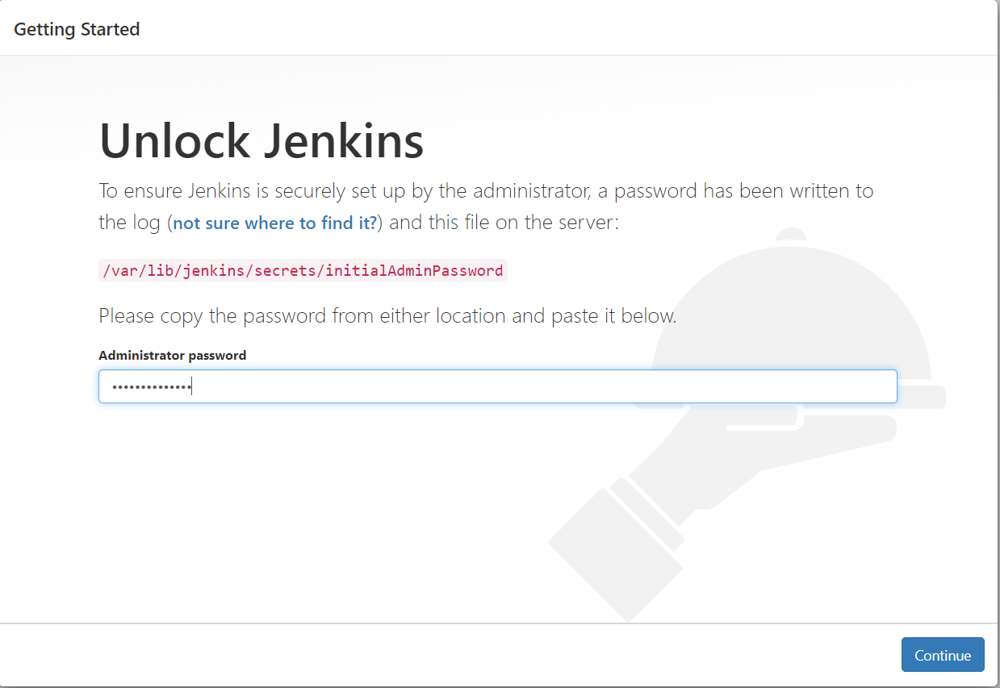
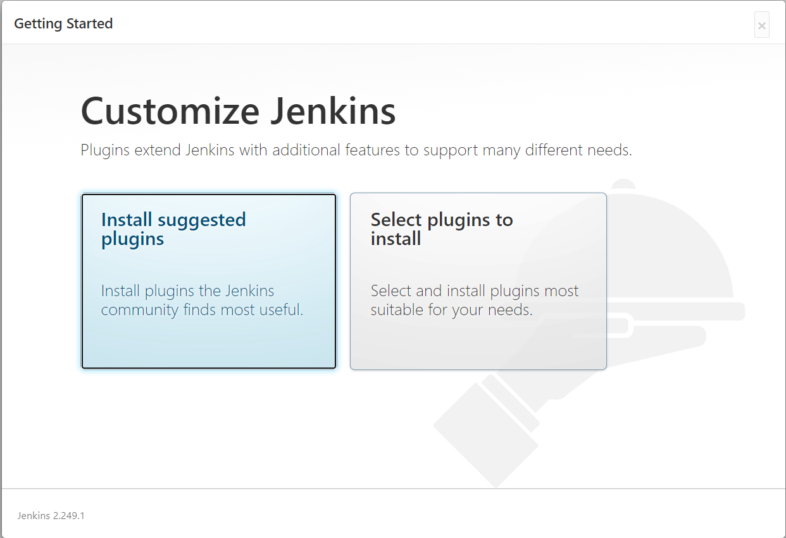
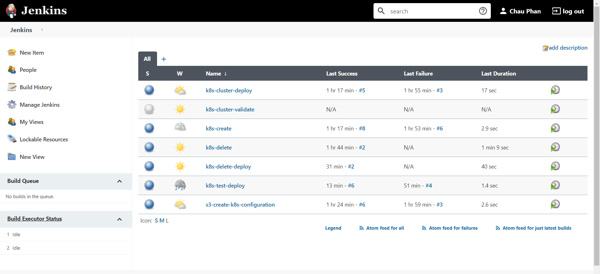
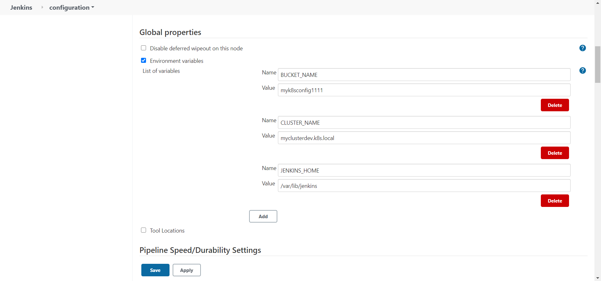
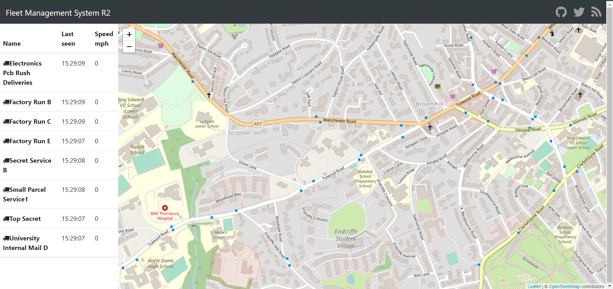

# I. How to create Bastion Host with Ansible/Jenkins/kops by Terraform
# II. How to use Bastion Host to deploy K8S cluster (to AWS Cloud)

## The Bastion Host is an AWS EC2 node Ubuntu 18.04 which is deployed by Terraform includes:
### 1.    Ansible
### 2.    Jenkins with HTTPS configuration, HTTPS port 8443
### 3.    AWS CLI
### 4.    kops
### 5.    Jenkins jobs to deploy the k8s cluster to system

#### You need terrform to install bastion host, refer to https://www.terraform.io/downloads.html to download and install to your system
#### The Bastion Host has roles Full to S3, EC2, IAM, Loadbalancer and Autoscaling to peform kops command

## Input AWS credentials key to your local machines
aws configure

```
AWS Access Key ID [****************XUOH]: XXXXXXXXXXXXXXXXXXXXXXXXXXXXXXXXXXX
AWS Secret Access Key [****************EQSD]: XXXXXXXXXXXXXXXXXXXXXXXXXXXXXXX
Default region name [us-east-1]:
Default output format [json]:
```
## Generate SSH key for Bastion host
ssh-keygen
```
Generating public/private rsa key pair.
Enter file in which to save the key (/home/cloud_user/.ssh/id_rsa):
```
### The key name id_rsa must be copy into same directory with Terrform directory
## Init and validate the bastionhost_kops_jenkins
terraform init

```
Initializing the backend...

Initializing provider plugins...
- Using previously-installed hashicorp/aws v3.6.0

The following providers do not have any version constraints in configuration,
so the latest version was installed.

To prevent automatic upgrades to new major versions that may contain breaking
changes, we recommend adding version constraints in a required_providers block
in your configuration, with the constraint strings suggested below.

* hashicorp/aws: version = "~> 3.6.0"

Terraform has been successfully initialized!

You may now begin working with Terraform. Try running "terraform plan" to see
any changes that are required for your infrastructure. All Terraform commands
should now work.

If you ever set or change modules or backend configuration for Terraform,
rerun this command to reinitialize your working directory. If you forget, other
commands will detect it and remind you to do so if necessary.
```

## Terraform validate
terraform validate

```
Success! The configuration is valid.
```
## Terrform apply
```
Do you want to perform these actions?
  Terraform will perform the actions described above.
  Only 'yes' will be accepted to approve.

  Enter a value: yes

aws_key_pair.bastion-host: Creating...
aws_iam_role.kops: Creating...
aws_default_vpc.default: Creating...
aws_iam_role.kops: Creation complete after 1s [id=kops]
aws_iam_instance_profile.kops_profile: Creating...
aws_iam_role_policy.kops_policy: Creating...
aws_key_pair.bastion-host: Creation complete after 1s [id=bastion-host]
aws_iam_role_policy.kops_policy: Creation complete after 0s [id=kops:kops]
aws_iam_instance_profile.kops_profile: Creation complete after 1s [id=kops_profile]
aws_default_vpc.default: Creation complete after 4s [id=vpc-XXXXXXXXXXXXXXXXXX]
aws_security_group.bastion-host-sg: Creating...
aws_security_group.bastion-host-sg: Creation complete after 4s [id=sg-XXXXXXXXXXXXXXXXXX]
aws_instance.bastion-host: Creating...
aws_instance.bastion-host: Still creating... [10s elapsed]
aws_instance.bastion-host: Still creating... [20s elapsed]
aws_instance.bastion-host: Still creating... [30s elapsed]
aws_instance.bastion-host: Provisioning with 'local-exec'...
aws_instance.bastion-host (local-exec): Executing: ["/bin/sh" "-c" "echo XXXXXXXXXXXXXXXXXX > public_ip.txt"]
aws_instance.bastion-host: Creation complete after 35s [id=i-XXXXXXXXXXXXXXXXXX]

Apply complete! Resources: 7 added, 0 changed, 0 destroyed.

```
## Setup HTTPS for Jenkins
### Generate key for Jenkins
#### Create key and certificate. Provide information wherever asked.
sudo openssl req -newkey rsa:2048 -nodes -keyout jenkins.key -x509 -days 700 -out jenkins.crt
#### Below command would ask you for password. Remember the same as that will be used during the configuration.
sudo openssl pkcs12 -inkey jenkins.key -in jenkins.crt -export -out jenkins.pkcs12
#### Import the key to java jenkins
sudo keytool -importkeystore -srckeystore jenkins.pkcs12 -srcstoretype pkcs12 -destkeystore /var/lib/jenkins/jenkins.jks -deststoretype PKCS12
#### Modify the jenkins configuration to support jenkins

sudo vi /etc/default/jenkins
```
JENKINS_ARGS="--webroot=/var/cache/$NAME/war --httpPort=-1 --httpsPort=8443 --httpsKeyStore="/var/lib/jenkins/jenkins.jks" --httpsKeyStorePassword="XXXXXX"
```
**Make sure that the store password is match with the store password you defined**
#### Restart jenkins
sudo service jenkins restart

# II. Jenkins jobs loading
## Copy all the jobs to Bastion Host /tmp/ directory
```
scp -pr jobs ubuntu@`cat public_ip.txt`:/tmp/
config.xml                                                                                                                                                                      100% 1291    18.7KB/s   00:00
config.xml                                                                                                                                                                      100% 1478    21.4KB/s   00:00
config.xml                                                                                                                                                                      100%  955    13.9KB/s   00:00
config.xml                                                                                                                                                                      100% 1038    15.1KB/s   00:00
config.xml                                                                                                                                                                      100% 1478    21.5KB/s   00:00
config.xml                                                                                                                                                                      100% 1331    16.3KB/s   00:00
config.xml                                                                                                                                                                      100% 1337    19.4KB/s   00:00
config.xml                                                                                                                                                                      100%  694    10.1KB/s   00:00
config.xml                                                                                                                                                                      100% 1404    20.2KB/s   00:00
config.xml                                                                                                                                                                      100% 1745    25.3KB/s   00:00
config.xml                                                                                                                                                                      100% 1334    19.3KB/s   00:00
config.xml                                                                                                                                                                      100% 1534    22.3KB/s   00:00
config.xml                                                                                                                                                                      100%  468     6.8KB/s   00:00
```
## Log into the Bastion Host 
ssh ubuntu@\`cat public_ip.txt\`
## Change owner of the directory
cd /tmp
chown -R jenkins:jenkins jobs
## Move the job to jenkins jobs
sudo cp -pr /tmp/jobs/* /var/lib/jenkins/jobs/
## Restart jenkins
sudo service jenkins restart
## Access to Jenkins and input the Admin password from
```
sudo cat /var/lib/jenkins/secrets/initialAdminPassword
```


## Install the needed jenkins following the instruction

## After done, you can see all available k8s job available

# III. Use K8S jobs to deploy the Kubenetes system to AWS
## Jobs conducting a k8s cluster includes: 
### 1. s3-create-k8s-configuration: Jobs to create S3 bucket to store k8s configuration
### 2. k8s-create: Create k8s cluster configuration and put into S3 
### 3. k8s-cluster-deploy: Deploy K8S cluster to AWS 
### 4. k8s-cluster-validate: Validate cluster

## Setting Global Variables for Jenkins before deploying
##### From Jenkins GUI, go to Manage Jenkins --> Configuration System --> Global properties --> Environment variables
##### Set:
##### CLUSTER_NAME = myk8s.cluster.local
##### BUCKET_NAME = myk8sconfig
##### JENKINS_HOME = /var/lib/jenkins
##### --> Save

### 1. Create S3 bucket to store your k8s configuration
Run the 1st job
```
Started by user Chau Phan
Running as SYSTEM
Building in workspace /var/lib/jenkins/workspace/s3-create-k8s-configuration
[s3-create-k8s-configuration] $ /bin/sh -xe /tmp/jenkins7863059195966590215.sh
+ aws s3api create-bucket --bucket myk8sconfiguration --region us-east-1
{
    "Location": "/myk8sconfiguration"
}
+ aws s3api put-bucket-versioning --bucket myk8sconfiguration --versioning-configuration Status=Enabled
+ aws s3api put-bucket-encryption --bucket myk8sconfiguration --server-side-encryption-configuration {"Rules":[{"ApplyServerSideEncryptionByDefault":{"SSEAlgorithm":"AES256"}}]}
Finished: SUCCESS
```
### 2. K8s create
Run task 2
```
Started by user Chau Phan
Running as SYSTEM
Building in workspace /var/lib/jenkins/workspace/k8s-create
[k8s-create] $ /bin/sh -xe /tmp/jenkins2508087537739312406.sh
+ kops create cluster --node-count=3 --zones=us-east-1a,us-east-1b,us-east-1c mycluster.k8s.local --state=s3://myk8sconfig
...
Must specify --yes to apply changes

Cluster configuration has been created.

Suggestions:
 * list clusters with: kops get cluster
 * edit this cluster with: kops edit cluster mycluster.k8s.local
 * edit your node instance group: kops edit ig --name=mycluster.k8s.local nodes
 * edit your master instance group: kops edit ig --name=mycluster.k8s.local master-us-east-1a

Finally configure your cluster with: kops update cluster --name mycluster.k8s.local --yes

Finished: SUCCESS
```
### 3. K8S deploy 
Run task 3, k8s deploy
```
Started by user Chau Phan
Running as SYSTEM
Building in workspace /var/lib/jenkins/workspace/k8s-cluster-deploy
[k8s-cluster-deploy] $ /bin/sh -xe /tmp/jenkins808132597314883670.sh
+ kops update cluster mycluster.k8s.local --state=s3://myk8sconfig --yes
...
Cluster is starting.  It should be ready in a few minutes.

Suggestions:
 * validate cluster: kops validate cluster --wait 10m
 * list nodes: kubectl get nodes --show-labels
 * ssh to the master: ssh -i ~/.ssh/id_rsa ubuntu@api.mycluster.k8s.local
 * the ubuntu user is specific to Ubuntu. If not using Ubuntu please use the appropriate user based on your OS.
 * read about installing addons at: https://kops.sigs.k8s.io/operations/addons.

Finished: SUCCESS
```
### 4. K8S validate
Run the taks validate 
```
Started by user Chau Phan
Running as SYSTEM
Building in workspace /var/lib/jenkins/workspace/k8s-cluster-validate
[k8s-cluster-validate] $ /bin/sh -xe /tmp/jenkins6147647716333892869.sh
+ kops validate cluster --name=mycluster.k8s.local --state=s3://myk8sconfig
Validating cluster mycluster.k8s.local

INSTANCE GROUPS
NAME			ROLE	MACHINETYPE	MIN	MAX	SUBNETS
master-us-east-1a	Master	t3.medium	1	1	us-east-1a
nodes			Node	t3.medium	3	3	us-east-1a,us-east-1b,us-east-1c

NODE STATUS
NAME				ROLE	READY
ip-172-20-123-174.ec2.internal	node	True
ip-172-20-47-247.ec2.internal	master	True
ip-172-20-63-205.ec2.internal	node	True
ip-172-20-79-77.ec2.internal	node	True
```
Your cluster mycluster.k8s.local is ready
Finished: SUCCESS
### 5. Deploy the test application into K8S
```
Started by user Chau Phan
Running as SYSTEM
Building in workspace /var/lib/jenkins/workspace/k8s-test-deploy
[k8s-test-deploy] $ /bin/sh -xe /tmp/jenkins9199438205528836665.sh
+ kubectl apply -f /var/lib/jenkins/jobs/Deploy/storage-aws.yaml
persistentvolumeclaim/mongo-pvc created
storageclass.storage.k8s.io/cloud-ssd created
+ kubectl apply -f /var/lib/jenkins/jobs/Deploy/mongo-stack.yaml
deployment.apps/mongodb created
service/fleetman-mongodb created
+ kubectl apply -f /var/lib/jenkins/jobs/Deploy/services.yaml
service/fleetman-webapp created
service/fleetman-queue created
service/fleetman-position-tracker created
service/fleetman-api-gateway created
+ kubectl apply -f /var/lib/jenkins/jobs/Deploy/workloads.yaml
deployment.apps/queue created
deployment.apps/position-simulator created
deployment.apps/position-tracker created
deployment.apps/api-gateway created
deployment.apps/webapp created
Finished: SUCCESS
```
### 6. Check SVC under jenkins user
kubectl get svc
```

NAME                        TYPE           CLUSTER-IP       EXTERNAL-IP                                                               PORT(S)              AGE
fleetman-api-gateway        ClusterIP      100.70.164.112   <none>                                                                    8080/TCP             2m18s
fleetman-mongodb            ClusterIP      100.67.201.85    <none>                                                                    27017/TCP            2m18s
fleetman-position-tracker   ClusterIP      100.66.61.59     <none>                                                                    8080/TCP             2m18s
fleetman-queue              ClusterIP      100.69.128.221   <none>                                                                    8161/TCP,61616/TCP   2m18s
fleetman-webapp             LoadBalancer   100.65.230.145   XXXXXXXXXXXXXXXXXXXXXXXXXXXXXXXXX.amazonaws.com   80:31059/TCP         2m18s
kubernetes                  ClusterIP      100.64.0.1       <none>                                                                    443/TCP              62m

```
#### Copy and paste the LoadBalancer External-IP to see the traffic tracking application running well. You can setup this Jenkins job to GitHub to auto deploy your application to k8s cluster.


### 7. K8S delete
```
Started by user Chau Phan
Running as SYSTEM
Building in workspace /var/lib/jenkins/workspace/k8s-delete
[k8s-delete] $ /bin/sh -xe /tmp/jenkins2853240499787656079.sh
+ kops delete cluster mycluster.k8s.local --state=s3://myk8sconfig --yes
...
Deleted kubectl config for mycluster.k8s.local

Deleted cluster: "mycluster.k8s.local"
Finished: SUCCESS
```
# 8. Terraform destroy the bastion node
terraform destroy
```
Do you really want to destroy all resources?
  Terraform will destroy all your managed infrastructure, as shown above.
  There is no undo. Only 'yes' will be accepted to confirm.

  Enter a value: yes

aws_iam_role_policy.kops_policy: Destroying... [id=kops:kops]
aws_instance.bastion-host: Destroying... [id=i-XXXXXXXXXXXXXXXX]
aws_iam_role_policy.kops_policy: Destruction complete after 0s
...
aws_default_vpc.default: Destruction complete after 0s
aws_iam_role.kops: Destruction complete after 0s

Destroy complete! Resources: 7 destroyed.
```
